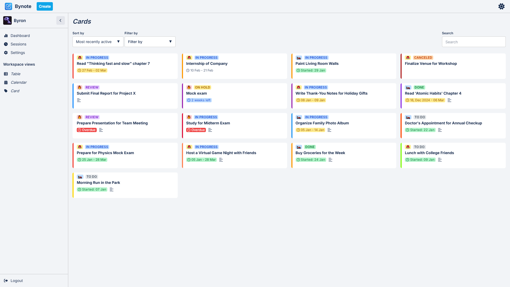

<a name="readme-top"></a>

<!-- PROJECT LOGO -->
<br />
<div align="center">
  <a href="public/icon.png">
    
  </a>

  <h3 align="center">AI-powered Study Planner</h3>

  <p align="center">
    Optimize your learning with scheduling!
    <br />
    <a href="https://youtu.be/Jqcf1iWhTMU"><strong>View Demo »</strong></a>
  </p>
</div>

<!-- TABLE OF CONTENTS -->
<details>
  <summary>Table of Contents</summary>
  <ol>
    <li>
      <a href="#about-the-project">About The Project</a>
      <ul>
        <li><a href="#built-with">Built With</a></li>
      </ul>
    </li>
    <li>
      <a href="#getting-started">Getting Started</a>
      <ul>
        <li><a href="#prerequisites">Prerequisites</a></li>
        <li><a href="#installation">Installation</a></li>
      </ul>
    </li>
    <li><a href="#usage">Usage</a></li>
    <li><a href="#license">License</a></li>
    <li><a href="#contact">Contact</a></li>
  </ol>
</details>

<!-- ABOUT THE PROJECT -->

## About The Project



The **AI-powered Study Planner** is a web application designed to help students and lifelong learners manage their study schedules effectively. Leveraging AI, it provides personalized feedback and insights to optimize learning efficiency and time management.

### Key Features:
- **Authentication & Profile Management**: Secure login and session management using session cookies.
- **Task Management**: Add, update, delete, and prioritize tasks.
- **Task Scheduling**: Drag-and-drop tasks into a calendar view.
- **AI Suggestions**: Receive AI-driven insights to optimize study schedules and prevent burnout.
- **Focus Timer**: Track study sessions using the Pomodoro technique.
- **Analytics**: Visualize study habits and receive performance insights.

<p align="right">(<a href="#readme-top">back to top</a>)</p>

### Built With

- [![Next.js][Next.js]][Next-url]
- [![MongoDB][MongoDB.js]][MongoDB-url]
- [![TailwindCSS][TailwindCSS.js]][TailwindCSS-url]

<p align="right">(<a href="#readme-top">back to top</a>)</p>

<!-- GETTING STARTED -->

## Getting Started

To set up the project locally, follow these steps.

### Prerequisites

- Node.js and npm installed.
- MongoDB instance running.

### Installation

1. Clone the repository:
   ```sh
   git clone ...
   ```
2. Install dependencies:
   ```sh
   npm install
   ```
3. Set up environment variables:
   - Create a `.env.local` file in the root directory.
   - Add the variables found in `.env.example`.
4. Start the development server:
   ```sh
   npm run dev
   ```

<p align="right">(<a href="#readme-top">back to top</a>)</p>

<!-- USAGE EXAMPLES -->

## Usage

- **Add & Manage Tasks**: Create study tasks with priority levels.
- **Schedule Tasks**: Organize your study plan in a calendar view.
- **Use AI Insights**: Optimize your study sessions with AI-powered feedback.
- **Focus Timer**: Track sessions with the built-in Pomodoro timer.
- **Analyze Progress**: View study analytics and track efficiency.

<p align="right">(<a href="#readme-top">back to top</a>)</p>

<!-- LICENSE -->

## License

Distributed under the MIT License. See `LICENSE` for more information.

<p align="right">(<a href="#readme-top">back to top</a>)</p>

<!-- CONTACT -->

## Contact

Your Name - your.email@example.com

Project Link: [GitHub Repo](https://github.com/your_username/ai-study-planner)

<p align="right">(<a href="#readme-top">back to top</a>)</p>

<!-- MARKDOWN LINKS & IMAGES -->

[Next.js]: https://img.shields.io/badge/Next.js-000000?style=for-the-badge&logo=next.js&logoColor=white
[Next-url]: https://nextjs.org/
[MongoDB.js]: https://img.shields.io/badge/MongoDB-47A248?style=for-the-badge&logo=mongodb&logoColor=white
[MongoDB-url]: https://www.mongodb.com/
[TailwindCSS.js]: https://img.shields.io/badge/Tailwind_CSS-38B2AC?style=for-the-badge&logo=tailwind-css&logoColor=white
[TailwindCSS-url]: https://tailwindcss.com/

